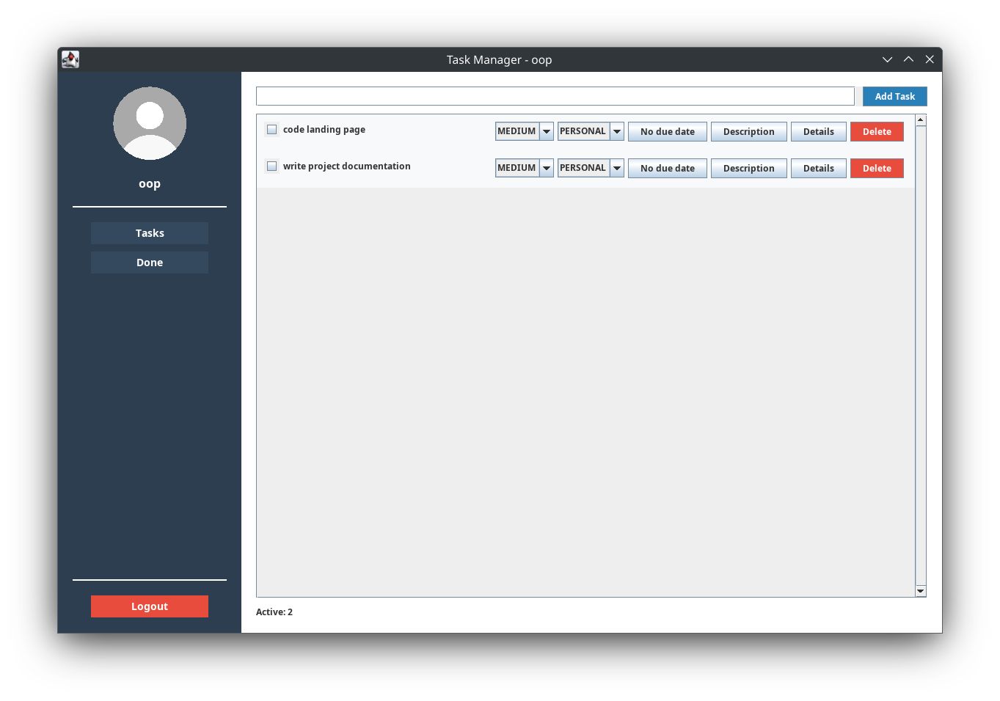

# Task Manager Application Documentation

[](https://opensource.org/licenses/MIT)

## Table of Contents
1. [Introduction](#introduction)
2. [Installation and Setup](#installation-and-setup)
3. [System Architecture](#system-architecture)
4. [User Interface](#user-interface)
5. [Data Model](#data-model)
6. [Authentication System](#authentication-system)
7. [Data Persistence](#data-persistence)
8. [Task Management Features](#task-management-features)
9. [Use Cases](#use-cases)
10. [Class Diagrams](#class-diagrams)
11. [Sequence Diagrams](#sequence-diagrams)
12. [Future Enhancements](#future-enhancements)

## Introduction

The Task Manager is a Java Swing-based desktop application designed to help users organize and track their tasks efficiently. The application provides a modern, user-friendly interface with features for task creation, categorization, prioritization, and completion tracking.

### Key Features
- Modern splash screen with task manager icon
- User authentication with secure login
- Task creation and management
- Task categorization (School, Work, Personal)
- Priority levels (High, Medium, Low)
- Due date and time assignment
- Task descriptions
- Task completion tracking
- Data persistence across sessions
- Modern UI with gradient backgrounds
- Profile section with avatar support
- Responsive window sizing
- Beautiful and intuitive login screen

## Installation and Setup

### Prerequisites
- Java 17 or higher
- Git (optional, for cloning the repository)

### Installation Methods

#### Method 1: Using Git (Recommended)
1. Clone the repository:
   ```bash
   git clone https://github.com/yourusername/java-swing-project.git
   cd java-swing-project
   ```

2. Compile the Java files:
   ```bash
   javac -d bin src/main/java/com/taskmanager/*.java src/main/java/com/taskmanager/model/*.java src/main/java/com/taskmanager/util/*.java
   ```

3. Run the application:
   ```bash
   java -cp bin:src/main/resources com.taskmanager.Main
   ```

#### Method 2: Manual Download
1. Download the project ZIP file from the releases page
2. Extract the ZIP file to your desired location
3. Open a terminal/command prompt in the extracted directory
4. Create a `bin` directory:
   ```bash
   mkdir bin
   ```
5. Compile the Java files:
   ```bash
   javac -d bin src/main/java/com/taskmanager/*.java src/main/java/com/taskmanager/model/*.java src/main/java/com/taskmanager/util/*.java
   ```
6. Run the application:
   ```bash
   java -cp bin:src/main/resources com.taskmanager.Main
   ```

### Login Credentials
- Username: `oop`
- Password: `123`

### Project Structure
```
java-swing-project/
├── bin/                    # Compiled class files
├── docs/                   # Documentation and diagrams
│   ├── diagrams/          # Diagrams
│   └── screenshots/       # Application screenshots
├── src/
│   └── main/
│       ├── java/
│       │   └── com/
│       │       └── taskmanager/
│       │           ├── Main.java           # Application entry point
│       │           ├── SplashScreen.java    # Splash screen with application icon
│       │           ├── LoginScreen.java    # Login window
│       │           ├── MainWindow.java     # Main application window
│       │           ├── model/
│       │           │   └── Task.java      # Task data model
│       │           └── util/
│       │               ├── DataPersistence.java  # Data storage
│       │               └── UserAuth.java         # Authentication
│       └── resources/     # Application resources
│           └── images/    # Image assets
└── user_data/            # User task data storage
```

## System Architecture

The Task Manager application follows a modular architecture with clear separation of concerns:

### Components
1. **UI Layer**: Handles all user interface elements and interactions
   - `Main.java`: Application entry point
   - `SplashScreen.java`: Welcome screen with application icon
   - `LoginScreen.java`: User authentication interface
   - `MainWindow.java`: Main application interface

2. **Model Layer**: Contains data models and business logic
   - `Task.java`: Task data model
   - `User.java`: User data model

3. **Utility Layer**: Provides supporting functionality
   - `UserAuth.java`: Authentication logic
   - `DataPersistence.java`: Data storage and retrieval

## User Interface

The Task Manager features a modern, intuitive user interface with the following components:

### Login Screen
- Clean, modern design with gradient background
- Large, readable title
- Properly labeled input fields
- Responsive login button with hover effects
- Clear error message display

### Main Window
- **Window Size**: 1000x800 pixels
- **Sidebar**: 250px width, contains user profile, navigation buttons, and logout option
- **Task List**: Displays active and completed tasks with proper spacing
- **Task Input**: Field for adding new tasks with clear visual hierarchy
- **Task Controls**: Buttons for managing tasks (Description, Details, Delete)
- **Task Counters**: Shows the number of active and completed tasks

### Task Item
Each task item displays:
- Checkbox for completion status
- Task title with proper font styling
- Priority dropdown (HIGH, MEDIUM, LOW)
- Category dropdown (SCHOOL, WORK, PERSONAL)
- Due date button with date picker
- Description button with text editor
- Details button for task information
- Delete button with confirmation dialog

### Dialogs
- **Task Description Dialog**: For adding/editing task descriptions
- **Due Date Dialog**: For setting task due dates and times
- **Task Details Dialog**: For viewing all task information
- **Delete Confirmation Dialog**: For confirming task deletion

## Data Model

### Task Class
The `Task` class represents a task in the system with the following attributes:
- `id`: Unique identifier 
- `title`: Task title
- `description`: Task description
- `completed`: Boolean indicating completion status
- `priority`: Enum (HIGH, MEDIUM, LOW)
- `category`: Enum (SCHOOL, WORK, PERSONAL)
- `dueDate`: LocalDateTime for task deadline

### User Class
The `User` class represents a user in the system with:
- `password`: User's password
- `avatarPath`: Path to user's avatar image

## Authentication System

The authentication system is implemented in the `UserAuth` class:
- User accounts are hardcoded by the system developer
- Currently, there is only one predefined user account
- Authentication method to verify username and password
- Avatar retrieval method for user profiles

### Default User
- Username: `oop`, Password: `123`

Note: New user accounts cannot be created through the application interface. They must be added by the system developer by modifying the `UserAuth` class.

## Data Persistence

The `DataPersistence` class handles saving and loading task data:
- Tasks are stored in text files in the `user_data` directory
- Each user has their own task file (`username_tasks.txt`)
- Tasks are saved in a pipe-separated format
- Data is automatically saved when the application closes
- Data is loaded when the application starts

### Data Format
```
title|description|priority|category|completed|dueDate
```

## Task Management Features

### Task Management
The task management system provides a comprehensive set of features for managing tasks:

1. **Task Creation**
   - Create new tasks with title
   - Set initial priority and category
   - Add description
   - Set due date

2. **Task Editing**
   - Modify task title
   - Update description
   - Change priority
   - Change category
   - Update due date

3. **Task Completion**
   - Mark tasks as complete/incomplete
   - Move between active/completed lists
   - Visual indication of completion status

4. **Task Deletion**
   - Remove tasks from the system
   - Confirmation before deletion
   - Automatic UI updates

## Use Cases

### System Developer Use Cases
1. **User Account Creation**
   - Add new user account to `UserAuth` class
   - Set username and password
   - Set optional avatar path

### End User Use Cases
1. **User Authentication**
   - Launch application
   - Enter username and password
   - System validates credentials
   - If valid, opens main window
   - If invalid, shows error message
   - Logout returns to login screen

2. **Task Management**
   - Create new tasks with title, priority, category, description, and due date
   - Edit existing tasks
   - Mark tasks as complete/incomplete
   - View task details
   - Delete tasks
   - Tasks are automatically saved and loaded

## Screenshots

All screenshots are located in the `docs/screenshots` directory. Below are the required screenshots:

### Splash Screen


### Login Screen


### Tasks Screen


### Done Screen


## Class Diagrams

## UML Diagrams

### Sequence Diagrams

#### User Login Sequence


#### Task Management Sequence


### Use Case Diagrams

#### Developer Account Creation Sequence


#### Authentication Use Case


#### Task Management Use Case


### Main Classes


## Future Enhancements

### Potential Improvements
1. **Task Filtering**: Add ability to filter tasks by priority, category, or due date
2. **Task Sorting**: Add ability to sort tasks by various criteria
3. **Task Search**: Add search functionality to find tasks quickly
4. **Task Tags**: Add support for custom tags on tasks
5. **Task Reminders**: Add notification system for upcoming due dates
6. **Task Sharing**: Add ability to share tasks with other users
7. **Task Templates**: Add support for creating task templates
8. **Task Statistics**: Add charts and statistics for task completion
9. **Task Export**: Add ability to export tasks to various formats
10. **Task Import**: Add ability to import tasks from various formats
11. **Dark Mode**: Add support for dark mode theme
12. **Custom Categories**: Allow users to create custom task categories
13. **Task Attachments**: Allow users to attach files to tasks
14. **Task Comments**: Add support for comments on tasks
15. **Task Dependencies**: Add support for task dependencies
16. **Responsive Layout**: Improve window resizing behavior
17. **Keyboard Shortcuts**: Add keyboard shortcuts for common actions
18. **Task Colors**: Add color coding for different task types
19. **Task Recurrence**: Add support for recurring tasks
20. **Task Progress**: Add progress tracking for tasks

## Contributing

Contributions are welcome! Please feel free to submit a Pull Request.

### How to Contribute
1. Fork the repository
2. Create your feature branch (`git checkout -b feature/AmazingFeature`)
3. Commit your changes (`git commit -m 'Add some AmazingFeature'`)
4. Push to the branch (`git push origin feature/AmazingFeature`)
5. Open a Pull Request

### Development Setup
1. Clone the repository
2. Set up your development environment
3. Make your changes
4. Test your changes
5. Submit a pull request

## License

This project is licensed under the MIT License - see the [LICENSE](LICENSE) file for details.

## Acknowledgments

- Special thanks to Dr. Ahmed Nacer for his guidance and support
- Thanks to the Java Swing community for their excellent documentation and examples
- Thanks to all team members for their contributions to this project

---

Made with ❤️ by Team OOP2 - UMBB 2024/2025
