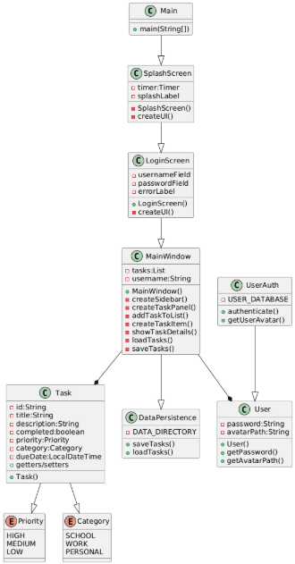

# UML Diagrams for Task Manager Application

All diagrams are available in the `docs/diagrams` directory. The diagrams were created using [PlantUML](https://plantuml.com/), a tool for creating UML diagrams from text.

## Use Case Diagram

The use case diagram shows the main functionalities of the Task Manager application:
- User authentication (Login/Logout)
- Task management (Create, Edit, Delete, Complete tasks)
- System features (Splash screen, Data persistence)

## Class Diagram

The class diagram illustrates the structure of the application:
- Main classes: `Main`, `SplashScreen`, `LoginScreen`, `MainWindow`
- Model classes: `Task`, `User`
- Utility classes: `UserAuth`, `DataPersistence`
- Enums: `Priority`, `Category`

## Sequence Diagrams

### Application Start Sequence

### User Login Sequence

### Task Management Sequence

### Task Description Sequence

### Task Due Date Sequence

### Application Close Sequence

## Diagram Source Files

The source files for all diagrams are available in the `docs/diagrams` directory:
- `use_case_diagram.puml`
- `class_diagram.puml`
- `sequence_app_start.puml`
- `sequence_login.puml`
- `sequence_task_management.puml`
- `sequence_task_description.puml`
- `sequence_task_due_date.puml`
- `sequence_app_close.puml`

To modify or regenerate the diagrams:
1. Install PlantUML
2. Edit the .puml files
3. Generate new diagrams using PlantUML 